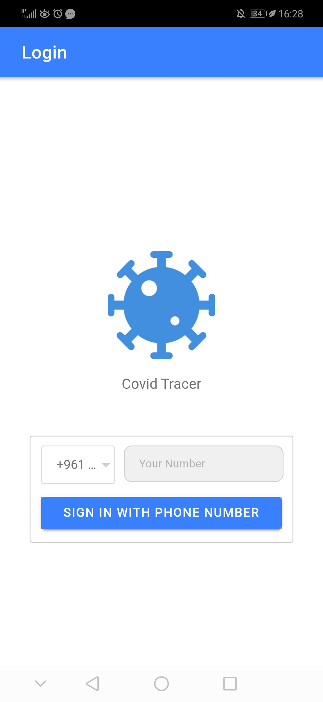
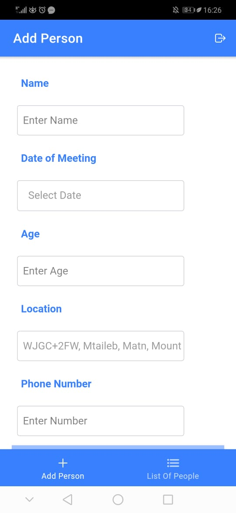
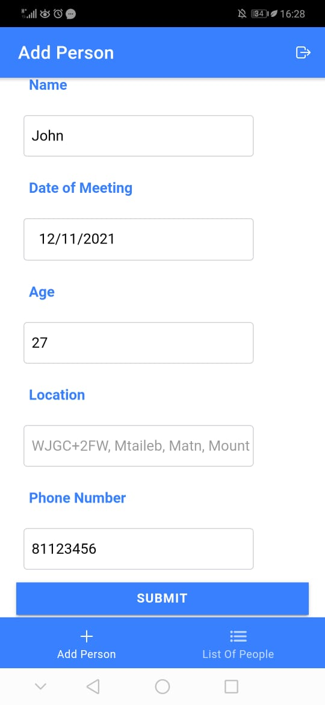
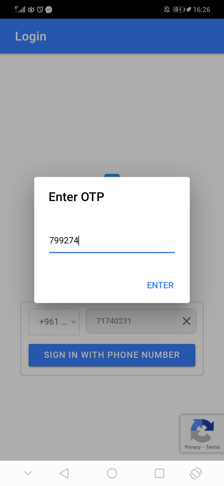
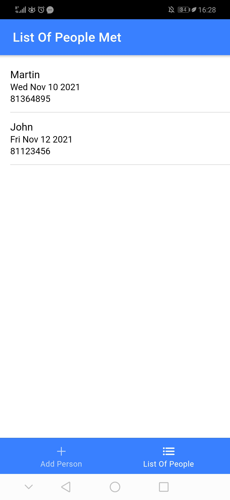

## Tracer App

#### Summary
----------
It is done using both Ionic and Firebase. The user will first be authenticated using Firebase Authentication by adding his/her phone number and recieving an OTP. Then after that, the user location is retrieved using the `geolocation` cordova plugin.

Then they will be able to add a new person that they met on a specific day. They can also check the list of users that they have met in each day.

#### Images
------











#### How To Setup
-----------

First, regarding the plugins used and npm packages, you can check the `installation_guide.txt` file which will contain all the commands.

Now regarding Firebase, navigate to the following url:

1. https://console.firebase.google.com/
2. Click create new project
3. Add project name, example "covid-tracer"
4. Disable Google Analytics
5. Click create project
6. Click continue

Now, the project will be created but not linked to any platform. So to link it to a platform you need to click on the below icon:


After clicking on the Icon, add the app nickname for exampel "covid-tracer" and then copy the `firebaseconfig` object and add it to the `environment.ts` file:

```js
export const environment = {
  production: false,
   firebaseConfig : {
    apiKey: '***',
    authDomain: '***',
    projectId: '***',
    storageBucket: '***',
    messagingSenderId: '***',
    appId: '***'
  }
};
```
*Note: replace "***" with the actual values in the object provided in Firebase console.*

Then, go back to the Firebase Console and click *Authentication > Get Started*, and enable the phone provider.

Now click on *Firestore Database* on the left menu and click *create database* and *start in test mode* and then *Enable*.

Now that everything is setup, all you have do is:

```
ionic cordova platform add android
ionic cordova build android
```

and the application will run on your phone.

